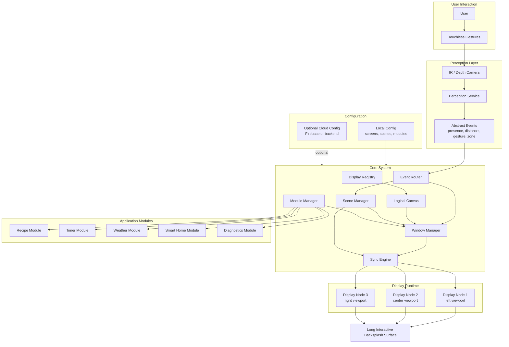

# AURA MK II

AURA MK II is a modular touchless interactive surface designed for smart kitchen backsplashes, long wall displays, and premium ambient interfaces.

It turns multiple physical displays into one coherent logical canvas, where windows, widgets, scenes, and modules can move across a long surface as if it were a single screen.

The first target use case is the kitchen backsplash: a clean, elegant, and useful interface placed behind a kitchen counter or cooking area, controlled without touching the surface.

## Core idea

AURA MK II is built around five principles:

- **Long interactive surface**: multiple displays work together as one large software-defined canvas.
- **Touchless interaction**: users navigate through gestures without leaving fingerprints, grease, water, or flour on the surface.
- **Modular software**: features can be added, removed, enabled, disabled, or customized without modifying the core system.
- **Local-first architecture**: the system must remain useful without cloud connectivity.
- **Privacy-oriented perception**: IR or depth-based sensing detects presence, distance, zones, and gestures without exposing raw camera images to the UI.

## Why it matters

Touchscreens are often a poor fit for kitchens and professional environments.

Hands can be wet, greasy, dirty, occupied, or wearing gloves. Voice control can also be unreliable in noisy environments such as kitchens, restaurants, workshops, gyms, or commercial spaces.

AURA MK II solves this by combining a long multi-screen interface, gesture-based navigation, local perception, modular widgets, synchronized display nodes, and a clean system architecture.

## Example use cases

### Home kitchen

- Recipe steps
- Timers
- Weather
- Calendar
- Shopping list
- Smart home controls
- Music controls
- Ambient status display

### Professional kitchen

- Multi-timer management
- Cooking workflow
- Order status
- Staff information
- Cleaning mode
- Touchless operation with gloves or dirty hands

### Premium spaces

- Hotel suites
- Luxury kitchens
- Showrooms
- Spas
- Gyms
- Retail spaces
- Reception areas

### Technical and industrial spaces

- Workshops
- Laboratories
- Clean environments
- Control walls
- Maintenance dashboards

## Architecture overview



## Main components

### Core System

The Core System is the local brain of AURA MK II.

It manages display registration, the logical canvas, window placement, scenes, modules, event routing, gesture interpretation, synchronization, and system health.

### Display Runtime

The Display Runtime runs on each physical display.

Each display node connects to the Core System, receives its assigned viewport, and renders only its portion of the global logical canvas.

### Perception Service

The Perception Service reads IR or depth sensor data and converts it into abstract events such as presence, distance, gesture, and active zone.

It should not expose raw camera frames to the user interface.

### Modules

Modules are self-contained features that can be enabled, disabled, configured, and displayed as windows.

Examples include recipe, timer, weather, calendar, smart-home, media, and diagnostics.

### Admin Console

The Admin Console is used to configure screens, canvas layout, scenes, enabled modules, devices, optional cloud settings, updates, and diagnostics.

### Configuration

Configuration files define local behavior such as screen positions, canvas size, enabled modules, scenes, logging, security, and optional cloud integration.

The system should remain usable without cloud connectivity.

## Repository structure

```text
aura-mk2/
├── README.md
├── core-system/
├── display-runtime/
├── perception-service/
├── modules/
├── admin-console/
├── shared/
├── config/
├── docs/
├── tools/
└── scripts/
```

## Suggested technology stack

### Core System

- C++20 or C++23
- CMake
- Boost.Asio or standalone Asio
- nlohmann/json
- yaml-cpp
- spdlog
- fmt
- systemd integration

### Display Runtime

- Flutter for the first visual MVP
- Flutter Linux desktop or embedded Linux target
- WebSocket client
- Custom canvas rendering
- Local viewport clipping

A future industrial version may use Qt/QML if required.

### Perception Service

- C++ for the final local service
- Python for early gesture simulation
- IR or depth camera SDK
- Local-only event publishing

### Communication

- WebSocket for local state synchronization
- JSON for the first protocol version
- Optional UDP for high-frequency events
- Optional Protobuf later if binary protocol becomes useful

### Configuration

- YAML for local configuration
- JSON Schema for protocol validation
- Optional Firebase or backend integration for remote configuration later

## MVP goals

### MVP 1

- Run one Core System locally
- Launch multiple Display Runtime instances
- Register display nodes automatically
- Define one global logical canvas
- Assign one viewport per display node
- Render multiple module windows
- Move windows between screens
- Load screens, modules, and scenes from config files
- Simulate gesture events

### MVP 2

- Add real perception input
- Detect presence
- Detect simple gestures
- Trigger scene changes with gestures
- Add cooking-oriented modules
- Add diagnostics overlay
- Add graceful behavior when a display node disconnects

### MVP 3

- Run on real multi-screen hardware
- Add systemd services
- Add local watchdog behavior
- Add privacy mode
- Add signed update strategy
- Add admin configuration interface

## Design principles

```text
The Core System decides.
The Display Runtime renders.
The Perception Service observes.
Modules provide functionality.
Configuration defines behavior.
```

## Documentation

Detailed technical documentation is available in:

```text
docs/
├── architecture.md
├── configuration.md
├── deployment.md
├── gesture-navigation.md
├── module-system.md
├── multi-screen-orchestration.md
├── privacy-model.md
├── protocol.md
└── roadmap.md
```

## Current status

AURA MK II is currently in early architecture and prototype planning.

The next step is to build a minimal local prototype with one Core System process, two or three Display Runtime instances, one logical canvas, static modules, scene configuration, and simulated gesture events.

## License

License to be defined.
